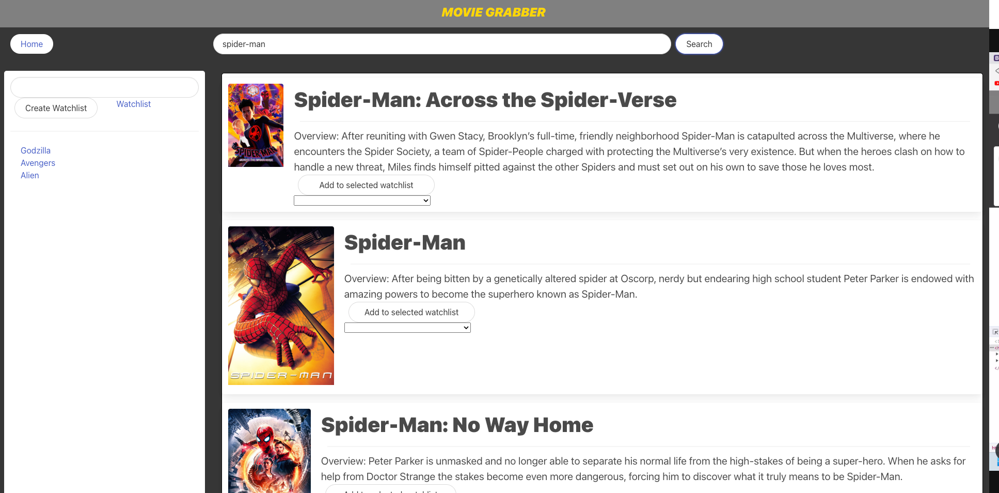

# movie-grabber

## Description



Simple movie search application, displays poster, title and overview. 

https://solomonkrow.github.io/movie-grabber/

## Usage

Click on search bar and enter movie name, click search and application displays list of movies. Can create a custom named list of movies user wants to watch by selection a dropdown and clicking button.

## Technologies
```
Bulma CSS Framework
Open Movie Database (OMDB) API
Movie Database (TMDB) API
```
## Acknowledgements
```
Holden
Giselle
Josiah
Mohit
Fred
```